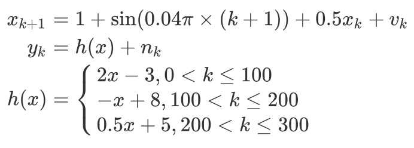
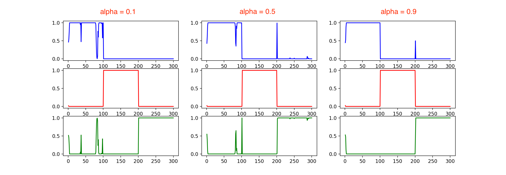

Offical implementation of **Dynamic Ensemble (DyEnsemble)** neural decoding algorithm (NeurIPS 2019). 

> Qi, Y., Liu, B., Wang, Y., & Pan, G. (2019). Dynamic ensemble modeling approach to nonstationary neural decoding in Brain-computer interfaces. In Advances in Neural Information Processing Systems (pp. 6089-6098).

Implemented by Zhuo Chen (Zhejiang University, https://github.com/zhuo34).

### How to run it

Here is an example for how to run `DyEnsemble` with codes in `main.py`.

**Firstly**, create customized transition functions and measurement functions by inheriting `DyEnsembleTModel` and `DyEnsembleMModel`. In this example, transition functions and measurement functions are shown as follows.



**Secondly**, generate simulation data.

**Thirdly**, create DyEnsemble.

```python
# model = DyEnsemble(x_dim, z_dim, t_model, *m_models)
model = DyEnsemble(x_dim, z_dim, F(x_dim, step), H1(z_dim), H2(z_dim), H3(z_dim))
```

**Finally**, use DyEnsemble.

```python
# model(x_idle, z, n_particle, alpha, save_pm=True):
model(0, y, 200, alpha[i], save_pm=True)
```

### 2 Results

Run `main.py` by `python main.py`, then you will get a figure in which each row represents the posterior probability of each mesurement model(function), and different columns represent different `alpha`.


